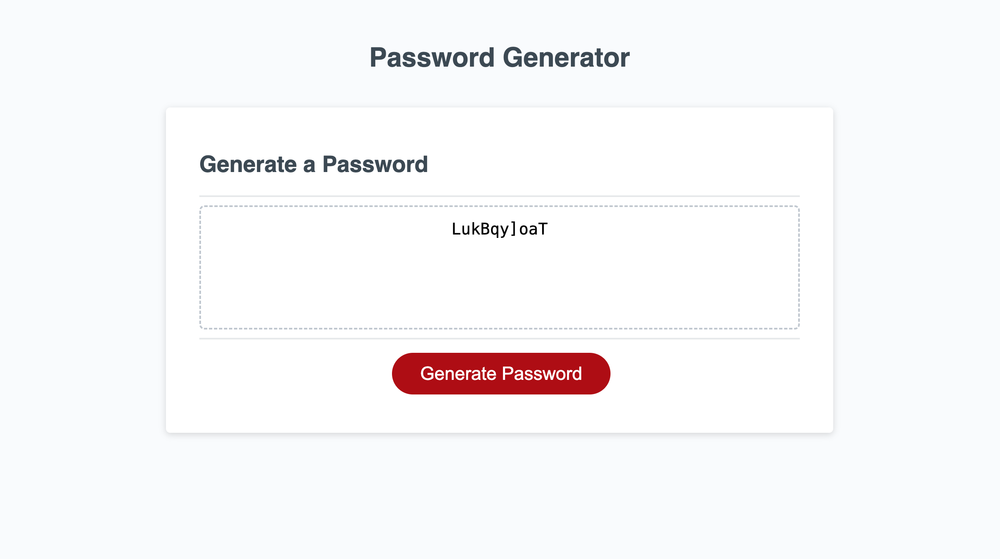

# Password-Generator
Creating a password generator using Javascript

## Description

This is a webpage that was created using Javascript to generate a random password. The user will be presented with a series of prompts for the password criteria, and a randomized password will be displayed in the box.

## Installation

N/A

## Usage

To use this webpage, the user can click the red "generate password" button at the bottom of the page to begin. First, it will prompt you with how many characters you would like to select for you password. Please select a length of at least 8 characters and no more than 128 characters. It will then ask you to confirm if you would like lowercase characters, uppercase characters, numbers, and/or special characters. After you have made your selections, a password will be created at random including the criteria that you have selected. The password will display inside of the box.

## Assets

The following image demonstrates the web application's appearance:

Here is the link to the deployed application:

## Credits

Acknowledgments: Worked on project with Marisol Aranda, Danniel Merino, Dalia Obeid, Amanda Vilwock, and Ryan Sarath. Used Xpert Learning Assistant, Module 3 mini project, and developer.mozilla.org as resources to create code. 

## License

MIT License (Please refer to license in repo)
